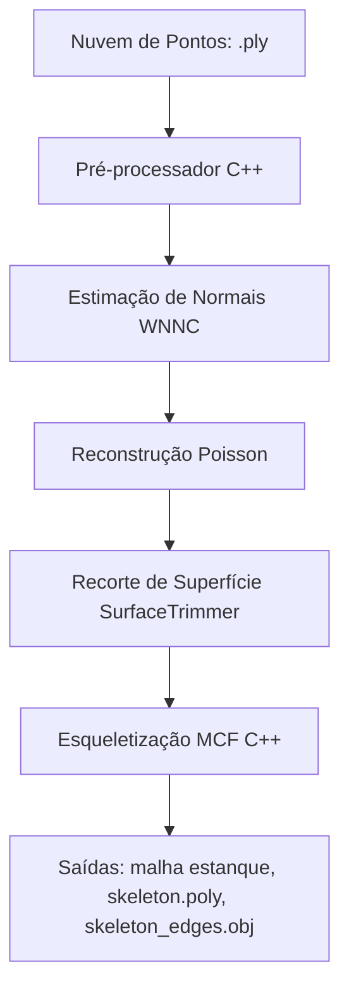

# Pipeline de Reconstrução de Superfície e Esqueletização (CGAL + WNNC)

Este repositório integra ferramentas avançadas de geometria computacional e aprendizado profundo para pré-processar nuvens de pontos 3D, estimar normais orientadas de forma consistente, reconstruir malhas triangulares fechadas (estanques) e extrair seus respectivos esqueletos topológicos.

## Visão Geral do Pipeline

O pipeline principal é orquestrado por [main.py](main.py) e executa cinco etapas integradas:



1. **Pré-processamento de Ponto (C++)**: Executa o binário `./build/preprocessor` para filtrar outliers, suavizar coordenadas com jatos locais (jet smoothing), regularizar o espaçamento via WLOP (Weighted Locally Optimal Projection) e, opcionalmente, realizar uma decimação inicial via **Subamostragem Espacial** por grade de voxels.
2. **Estimação de Normais Orientadas (WNNC)**: Roda o script `main_wnnc.py` utilizando o algoritmo *Winding Number Normal Consistency* (SIGGRAPH Asia 2024) para calcular e orientar globalmente as normais da nuvem de pontos, garantindo resiliência ao ruído.
3. **Reconstrução de Superfície Poisson (Kazhdan)**: Executa o binário `PoissonRecon` para gerar uma malha estanque a partir dos pontos orientados. Parâmetros como profundidade da árvore octree, peso dos pontos e amostragem por nó são estimados dinamicamente de acordo com a escala e densidade da nuvem de pontos (heurísticas em [heuristic.md](heuristic.md)).
4. **Recorte de Superfície**: Executa o binário `SurfaceTrimmer` para remover componentes de baixa densidade e rebarbas indesejadas da malha reconstruída.
5. **Esqueletização por Fluxo de Curvatura Média (C++)**: Executa o binário `./build/skeletonization` que normaliza a malha (garante triangulação, fecha furos e costura bordas), decima para um limite otimizado de ~50k faces e extrai o esqueleto geométrico por MCF (Mean Curvature Flow).

---

## Estrutura do Workspace

* **`preprocess/`**: Código-fonte C++ para etapas de pré-processamento (com CGAL) e esqueletização de malhas.
* **`wnnc/`**: Implementação Python/CUDA de *Winding Number Normal Consistency* para estimação de normais consistentes.
* **`AdaptiveSolvers/`**: Repositório integrado para reconstrução de superfície via Screened Poisson (Kazhdan).
* **`main.py`**: Ponto de entrada que gerencia e executa todas as etapas do pipeline.
* **`heuristic.md`**: Explicação matemática detalhada por trás das heurísticas de ajuste de parâmetros da reconstrução de Poisson.

---

## Como Iniciar do Zero

### 1. Requisitos C++ (AdaptiveSolvers & CGAL)

Instale as dependências necessárias para compilação das bibliotecas C++ (como Eigen3, CGAL, TBB e JPEG/PNG para Kazhdan):

```bash
# Dependências do Kazhdan AdaptiveSolvers
sudo apt-get update
sudo apt-get install libjpeg-dev libturbojpeg0-dev libpng-dev libtbb-dev

# Dependências CGAL e Eigen3 no sistema (exemplo Ubuntu)
sudo apt-get install libcgal-dev libeigen3-dev
```

Compilando as ferramentas C++ do `preprocess/`:
```bash
cd preprocess
mkdir -p build && cd build
cmake ..
cmake --build .
cd ../..
```

Compilando as ferramentas `AdaptiveSolvers` (PoissonRecon / SurfaceTrimmer):
```bash
cd AdaptiveSolvers
mkdir -p JPEG JPEG-turbo PNG ZLIB
make
cd ..
```

### 2. Ambiente Python e WNNC (via `uv`)

O projeto utiliza o gerenciador rápido [uv](https://github.com/astral-sh/uv). Como o WNNC possui extensões C++/CUDA nativas vinculadas ao PyTorch, a instalação deve ser realizada sem o isolamento de build padrão do Python:

```bash
# 1. Sincronize o ambiente virtual e dependências Python
uv sync

# 2. Compile e instale a extensão do WNNC em modo editável
cd wnnc/ext
uv run pip install -e . --no-build-isolation
cd ../..
```

O arquivo `pyproject.toml` está configurado para baixar automaticamente as dependências apropriadas para **CUDA 12.8** a partir do índice de wheels do PyTorch.

---

## Como Executar o Pipeline

Sempre ative o ambiente virtual antes de rodar os scripts:

```bash
source .venv/bin/activate
```

Para rodar o pipeline completo ponta a ponta com a nuvem de pontos padrão (`output_lui.ply`):

```bash
python main.py
```

Você pode modificar as variáveis de entrada, diretório de saída e caminhos dos binários diretamente no bloco `__main__` do `main.py`, bem como passar opções adicionais ao binário de pré-processamento (como `--enable-spatial-subsampling`, `--remove-outliers-percent`, etc.).
