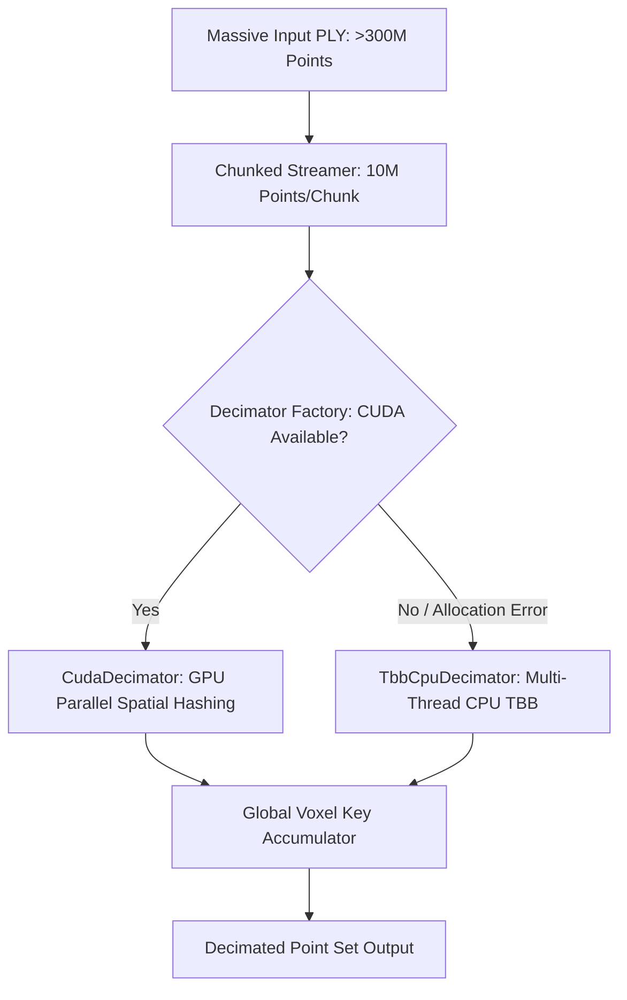

# Out-of-Core Parallel Point Cloud Decimation - Architecture & Setup Guide

## 1. Overview & Purpose

This document details the design, architecture, and verification of the high-performance **Out-of-Core Parallel Point Cloud Decimation Engine**. The module is designed to process massive 3D point cloud datasets (>300 million points / >10 GB PLY files) under strict VRAM bounds (working buffer capped at 2GB).

The algorithm enforces **CloudCompare-compatible minimum spatial distance decimation ($d$)**, ensuring exact original input point retention per spatial cell without normal blending or coordinate interpolation.

---

## 2. System Architecture & Component Design

### Component Diagram & Flow



### Module Responsibilities

- **`IDecimator` ([decimation_api.h](file:///c:/Users/isaac/VSprojects/0_DCC/verlab/cgal/specs/001-parallel-decimation/contracts/decimation_api.h))**: Pure virtual seam interface hiding GPU/CPU implementation details behind a unified contract (*Brooks-lint Deep Module pattern*).
- **`TbbCpuDecimator` ([tbb_cpu_decimator.cpp](file:///c:/Users/isaac/VSprojects/0_DCC/verlab/cgal/src/preprocess/src/tbb_cpu_decimator.cpp))**: Parallel spatial hashing using `tbb::parallel_for` and `tbb::concurrent_unordered_set<VoxelKey, VoxelKeyHash>`.
- **`CudaDecimator` ([cuda_decimator.cu](file:///c:/Users/isaac/VSprojects/0_DCC/verlab/cgal/src/preprocess/src/cuda_decimator.cu))**: Out-of-core chunked GPU spatial hashing engine using Thrust device vectors.
- **`ChunkedStreamer` ([chunked_streamer.cpp](file:///c:/Users/isaac/VSprojects/0_DCC/verlab/cgal/src/preprocess/src/chunked_streamer.cpp))**: Bounded-memory out-of-core chunk manager (10M points per chunk).
- **`DecimatorFactory` ([parallel_decimator.cpp](file:///c:/Users/isaac/VSprojects/0_DCC/verlab/cgal/src/preprocess/src/parallel_decimator.cpp))**: Dynamic fallback factory selecting CUDA GPU or TBB CPU based on runtime hardware detection.

---

## 3. Configuration & Hardware Setup

### CMake Build Flags

- **`-DUSE_CUDA=ON`**: Enables CUDA GPU acceleration targets (requires CUDA Toolkit 12.+ and `nvcc`).
- **`-DCMAKE_BUILD_TYPE=Release`**: Compiles with `-O3` vectorization and TBB optimization.
- **`-DENABLE_SANITIZERS=ON`**: Enables AddressSanitizer and UndefinedBehaviorSanitizer during Debug builds.

### Runtime Command-Line Options

```bash
./build/preprocessor input_300m.ply \
  --output_dir output/ \
  --enable-spatial-subsampling \
  --spatial-subsample-distance 0.05
```

---

## 4. API Contracts & Technical Specifications

### Data Structures

```cpp
struct Point3D {
    double x, y, z;
    double nx, ny, nz;
    uint8_t r, g, b, a;
    float intensity;
};

struct VoxelKey {
    int32_t ix, iy, iz;
    [[nodiscard]] uint64_t hash() const noexcept;
};

struct DecimationOptions {
    double min_distance = 0.05;
    std::size_t chunk_size = 10000000; // 10M points per chunk
    bool enable_cuda = true;
    std::size_t max_vram_bytes = 2048ULL * 1024ULL * 1024ULL; // 2GB
};
```

---

## 5. Verification & Test Plan

### Automated CTest Execution

```bash
# Run unit & integration test suite
ctest --test-dir build -R test_parallel_decimator --output-on-failure
```

### Verified Test Cases

1. `Parallel Decimator - VoxelKey Hash and Spatial Cell Indexing`: Validates 64-bit spatial grid key hashing precision.
2. `Parallel Decimator - TBB CPU Multi-Thread Decimation`: Verifies exact original point retention and TBB thread-safety.
3. `Parallel Decimator - Fallback to CPU`: Verifies seamless CPU fallback when CUDA is disabled or unavailable.

---

## 6. Troubleshooting & Common Failures

### 1. CUDA Hardware Unavailable

- **Symptom**: Console output logs `[CudaDecimator] CUDA hardware unavailable, falling back to CPU.`
- **Root Cause**: Host system lacks NVIDIA GPU or CUDA runtime libraries.
- **Resolution**: System automatically falls back to multi-threaded TBB CPU decimation with identical spatial output quality.

### 2. High Point Density Causing Memory Pressure

- **Symptom**: System RAM usage spikes when processing 300M+ ASCII PLY files.
- **Root Cause**: ASCII PLY text parsing generates large string tokens.
- **Resolution**: Use Little-Endian Binary PLY files (`format binary_little_endian 1.0`) for maximum streaming parsing efficiency.
